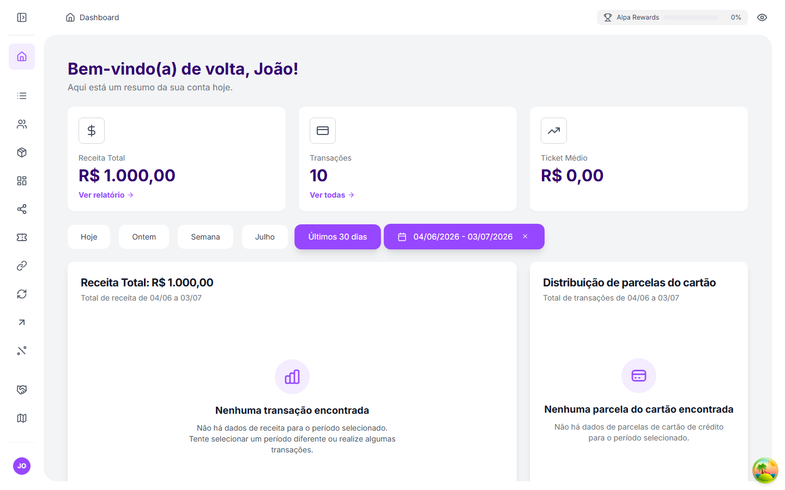
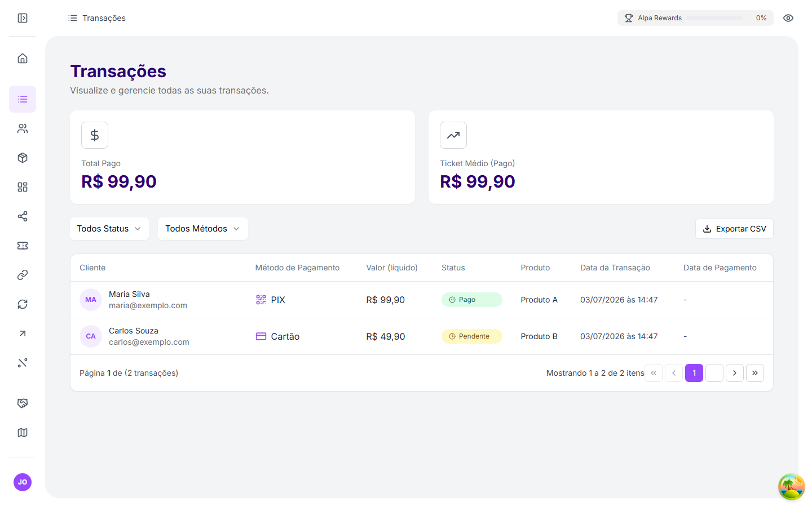
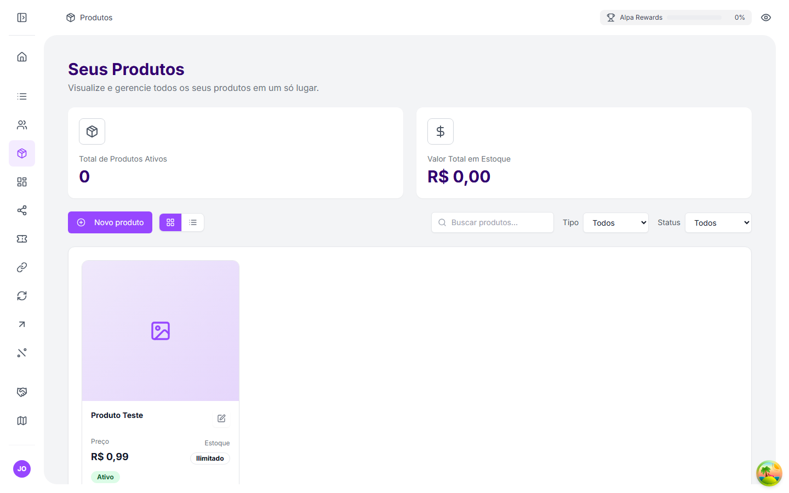
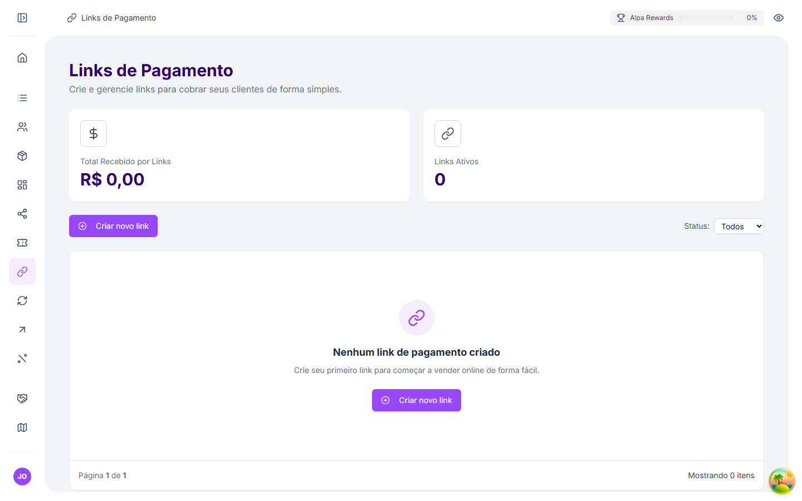
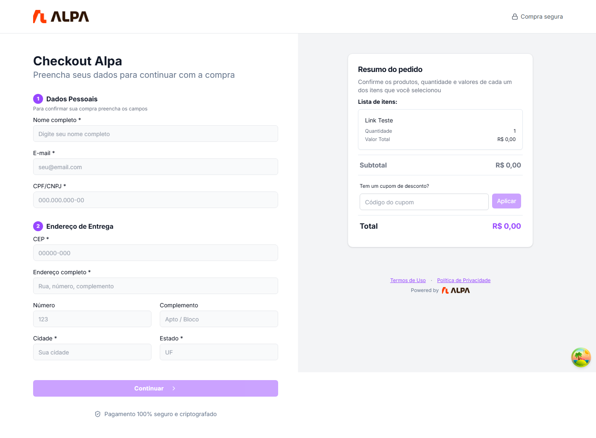
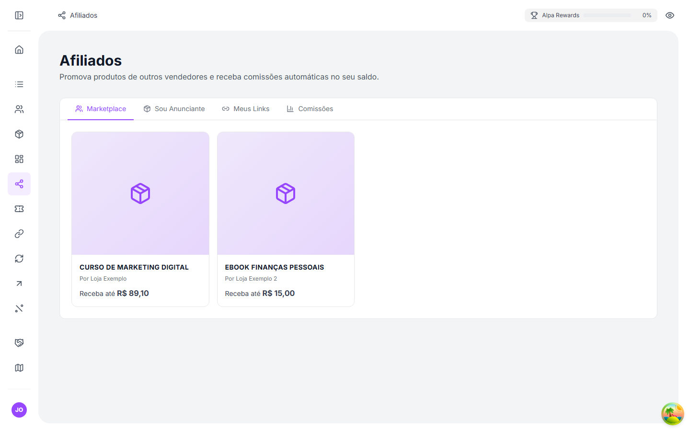
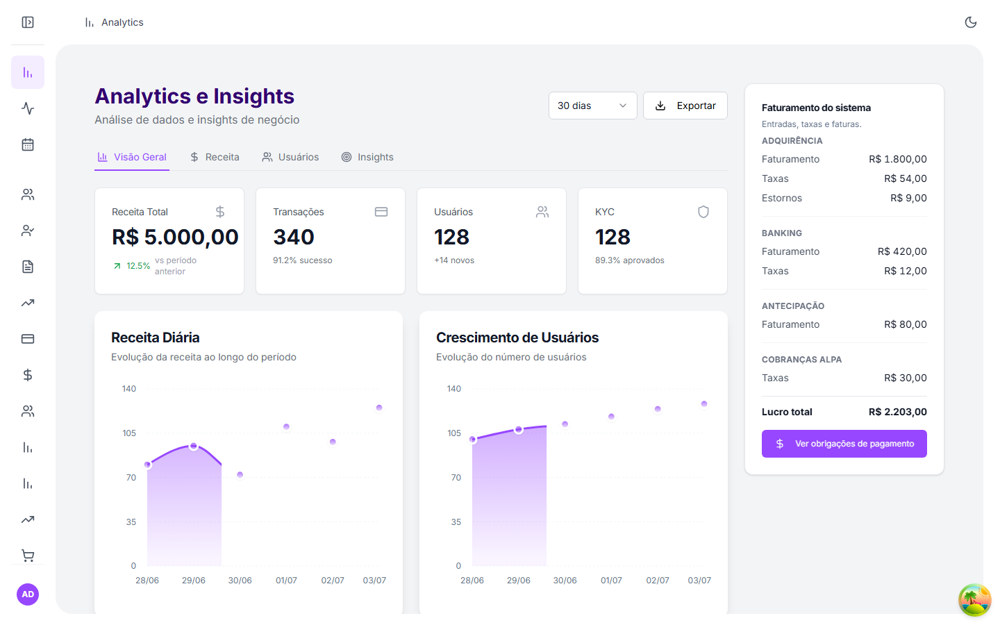
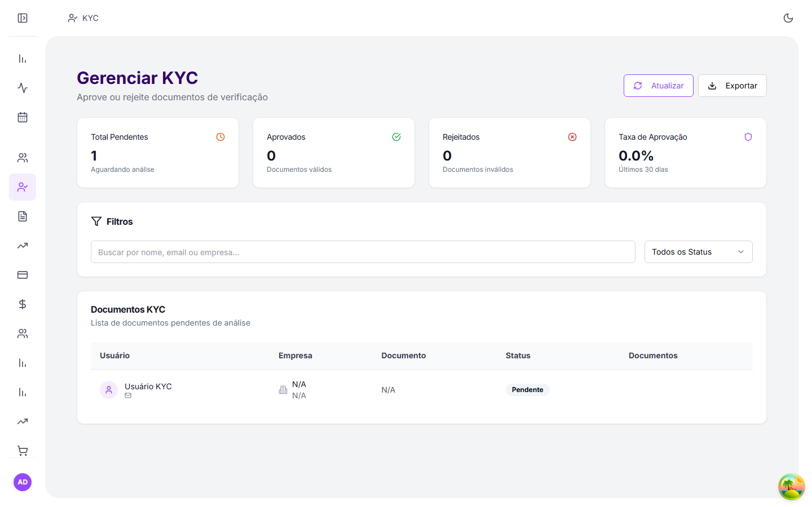

<!-- Upay | Sistema de Pagamentos White-Label -->

<div align="center">

<h1>Upay</h1>
<p><code>white-label payments platform</code></p>
<h3>Sistema de Pagamentos White-Label Full-Stack</h3>
<p><em>Plataforma de pagamentos white-label completa, com marketplace de afiliados, gestão financeira e painel administrativo avançado. "Upay" é o nome de referência do projeto; toda a identidade visual (logo, cores, domínio, SEO) é configurável por instância.</em></p>

<p>
  
  
  
  
  
  
</p>

<p>
  <a href="https://github.com/anthonymengottii" target="_blank">
    
  </a>
  <a href="mailto:anthonymengottii@gmail.com">
    
  </a>
  <a href="https://www.linkedin.com/in/anthony-mengotti-50026424a/" target="_blank">
    
  </a>
</p>

</div>

---

## Visão Geral

**Upay** é um **sistema de pagamentos white-label** full-stack construído do zero. Apesar do nome próprio, a plataforma foi projetada desde o início para ser rebrandada e operada sob qualquer marca. Gerencia o ciclo completo de pagamentos, do PIX e cartão ao marketplace de afiliados, gestão de saldo e conformidade regulatória, com arquitetura orientada a segurança e TypeScript strict em todo o projeto.

**White-label na prática**: cada instância configura logo, paleta de cores, domínio próprio (roteamento por subdomínio `app.*` / `checkout.*`), metadados de SEO e templates de email, sem alteração de código. "Upay" é apenas o nome de referência da instância demonstrativa.

Desenvolvido para competir em profundidade e confiabilidade com as principais plataformas de pagamento brasileiras (Iugu, Pagar.me, Hotmart).

---

## Destaques Técnicos

### Segurança e Conformidade
- **TypeScript strict** em todo o frontend e backend
- **Autenticação completa**: JWT + bcrypt, API Keys, login social Google (OAuth), MFA TOTP e gestão de sessões com revogação por dispositivo
- **KYC** com upload de documentos e revisão administrativa
- **RBAC** com 30+ permissões granulares
- **Rate limiting** por usuário, email e IP, contadores atômicos no Redis
- **Webhooks assinados** com HMAC-SHA256 e comparação timing-safe
- **Idempotency keys** em transações e cobranças de assinatura
- Sanitização XSS e validação de CPF/CNPJ (mod-11)
- **AuditLog imutável** com retenção de 5 anos (BACEN 4.658/2018) e **LGPD** (direito ao erasure)
- **Impersonação de admin com TOTP**: grace period de 30 min, modal e hook compartilhados no frontend
- **Sentry** em frontend e backend + job de reconciliação de saldo DB vs PSP

### Processamento de Pagamentos
- PIX instantâneo, cartão de crédito/débito (até 12x) e boleto
- **7 PSPs** com roteamento por prioridade e failover automático; Marlim como adquirente principal, Celcoin como rail dedicado de payout
- **Circuit breaker** por PSP com alertas automáticos no Sentry
- **Split de pagamentos** entre gateway e merchant
- **Limite de transação configurável**: global com override por empresa
- **OTP em saques e transferências**: 6 dígitos, SHA256, TTL no Redis, timing-safe
- **Webhooks de saída** com retry automático e assinatura HMAC
- Rastreamento de vendas com UTMs e click IDs via Utmify

### Assinaturas Recorrentes e Cart Abandonment
- Planos com trial, intervalo configurável e limite de assinantes
- Checkout público sem autenticação
- Métricas **MRR/churn** por merchant e retry automático de cobranças falhas
- **Cart abandonment**: captura de checkouts não finalizados com marcação de recuperação

### Marketing de Afiliados
- **Marketplace**: merchants criam programas por produto; afiliados solicitam afiliação
- Links rastreáveis `/pay/{slug}?aff={CODIGO}` com janela de cookie configurável
- Comissões (percentual ou fixa) creditadas automaticamente via transação atômica
- Métricas de cliques, conversões e status de comissão por link

### Recompensas e Comunidade
- **Upay Rewards**: tiers de recompensa por faturamento, progresso calculado automaticamente sobre transações pagas
- **Programa de indicações** (Indique e Ganhe): recompensa fixa na primeira transação do indicado + comissão recorrente configurável, com override por empresa
- **Sugestões da comunidade**: envio e feed público de sugestões aprovadas, com categorias e moderação admin
- **Roadmap estilo Kanban**: etapas (Ideia, Fase inicial, Em desenvolvimento, Finalizado) com curtidas da comunidade para priorização

### Arquitetura e Engenharia
- **Monorepo** com módulos independentes `api/` (Node.js) e `src/` (React)
- **Camada de serviços de domínio** isolada dos controllers
- **Prisma ORM** com migrações versionadas; **Redis** para cache e rate limit
- **Cloudinary** (imagens WebP via CDN) e compressão gzip/brotli
- **Roteamento por subdomínio**: `app.*` (dashboard) e `checkout.*` (checkout público)
- **OpenAPI 3.0** publicada via Mintlify

### Painel Administrativo
- **Quadro Kanban** com prioridades, responsáveis e colunas de status
- Papéis personalizados com toggles de permissão
- Templates de email editáveis (Handlebars) com comprovantes PDF
- Fila de KYC, aprovações de saque e antecipações

### App Mobile (Android)
- **React Native + Expo SDK 54**, mesmo backend/API do dashboard web
- NativeWind, React Navigation, Zustand e TanStack Query
- Dashboard com KPIs, transações, saques com OTP e perfil com upload de KYC
- **Status: MVP em desenvolvimento**, build EAS e Play Store pendentes

### Testes e CI/CD
- **340+ suítes / ~7.000 test cases**: Jest (backend) + Vitest (frontend)
- **19 fluxos E2E** com PostgreSQL real (sem mocks de banco)
- **GitHub Actions** (`unit.yml` + `e2e.yml`) com **ESLint 0 warnings** no CI

---

## Stack Tecnológico

<p align="center">
  
</p>

| Camada | Tecnologias |
|--------|-------------|
| **Frontend** | React 19, TypeScript, Vite 7, Tailwind CSS, shadcn/ui, Zustand, React Query |
| **Mobile** | React Native, Expo SDK 54, NativeWind, React Navigation, Zustand, TanStack Query |
| **Backend** | Node.js 20, Express, TypeScript, Zod |
| **Banco de Dados** | PostgreSQL 16+, Prisma 7 ORM, Redis 7 |
| **Autenticação** | JWT, bcrypt, API Keys, Google OAuth, TOTP (MFA) |
| **Armazenamento** | Cloudinary (WebP, CDN) |
| **Pagamentos** | Marlim, Pagar.me, Fyntra, Citrex, Ameii, PixBR.dev, Pague.dev + Celcoin (payout) + Utmify (rastreamento) |
| **Observabilidade** | Sentry (frontend + backend), circuit breaker, job de reconciliação |
| **DevOps** | Docker, GitHub Actions, Render (API), Vercel (Frontend) |
| **Docs** | Mintlify, OpenAPI 3.0, Swagger UI |

---

## Arquitetura do Sistema

```
┌─────────────────────────────────────────────────────────────────┐
│                       Frontend React                            │
│  Dashboard · Painel Admin · Checkout · Marketplace de Afiliados │
└────────────────────────────┬────────────────────────────────────┘
                             │ REST + Webhooks
┌────────────────────────────▼────────────────────────────────────┐
│                       Express API                               │
│  Auth · Pagamentos · Produtos · Afiliados · KYC · Admin         │
├─────────────────────────────────────────────────────────────────┤
│  Camada de Serviços                                             │
│  transactionService · affiliateService · referralService        │
│  balanceService · notificationService · webhookService          │
├──────────────────┬──────────────────────┬───────────────────────┤
│   PostgreSQL     │       Redis           │   Cloudinary / PSPs            │
│   (Prisma ORM)   │  (cache · rate limit) │   Marlim · Pagar.me · +5 PSPs  │
└──────────────────┴──────────────────────┴───────────────────────┘
```

---

## Funcionalidades

| Funcionalidade | Status |
|----------------|--------|
| Pagamento via PIX instantâneo | Produção |
| Cartão de crédito/débito (12x) | Produção |
| Boleto bancário | Produção |
| Multi-PSP com prioridade configurável (7 adquirentes: Marlim, Pagar.me, Fyntra, Citrex, Ameii, PixBR.dev, Pague.dev) | Produção |
| Limite de transação configurável (global + override por empresa) | Produção |
| OTP em saques e transferências (SHA256, Redis TTL, rate-limited) | Produção |
| KYC com revisão administrativa | Produção |
| MFA (TOTP Google Authenticator) | Produção |
| Impersonação de admin protegida por TOTP | Produção |
| Login social Google (OAuth) + gestão de sessões | Produção |
| Assinaturas de webhook HMAC-SHA256 | Produção |
| Sistema de cupons (% / fixo) | Produção |
| Catálogo de produtos + controle de estoque | Produção |
| Programa de indicações (recompensa fixa + comissão) | Produção |
| Sistema de recompensas por faturamento (Upay Rewards) | Produção |
| Sugestões da comunidade + Roadmap Kanban com curtidas | Produção |
| Marketplace de afiliados | Produção |
| **Assinaturas recorrentes** (MRR/churn, retry, trial) | Produção |
| **Cart abandonment** (captura + recuperação) | Produção |
| Saldo / saques / antecipações | Produção |
| RBAC administrativo (30+ permissões granulares) | Produção |
| Quadro Kanban administrativo | Produção |
| Idempotency keys | Produção |
| Split de pagamentos | Produção |
| Rastreamento UTM / vendas (Utmify) | Produção |
| Integração com Shopify | Produção |
| Rate limiting distribuído (Redis) | Produção |
| Circuit breaker por PSP | Produção |
| **AuditLog imutável** (BACEN 4.658/2018, 5 anos) | Produção |
| **LGPD, direito ao erasure** (`deleteMyData`) | Produção |
| Sentry (observabilidade + alertas automáticos) | Produção |
| White-label branding completo (logo, cor, SEO) | Produção |
| 340+ suítes / ~7.000+ TCs (unitários + E2E PostgreSQL) | Produção |
| OpenAPI 3.0 + Swagger UI | Produção |
| App mobile Android (React Native + Expo) | Em desenvolvimento (MVP) |

---

## Documentação Técnica

- **[Visão Geral da Arquitetura](docs/architecture-overview.md)**: componentes, camada de serviços, modelo de dados, deploy
- **[Integrações](docs/integrations.md)**: PSPs, payout, observabilidade, autenticação social, SDKs
- **[Decisões Técnicas de Infraestrutura](docs/decisions.md)**: ADRs com contexto, alternativas consideradas e consequências das principais decisões de infra

---

## Documentação Pública

Documentação completa da API disponível em **[docs.upaybr.com](https://docs.upaybr.com)**, incluindo:
- Guia de início rápido e autenticação
- Referência da API REST (especificação OpenAPI 3.0)
- Guia do sistema de afiliados
- Referência de eventos de webhook
- SDKs para Node.js, Python, PHP e Java

---

## Screenshots

> Capturados via Playwright com dados 100% fictícios (sem conexão a banco/produção real).

### Demo navegando (checkout + dashboard)

<p align="center">
  
</p>

<table>
  <tr>
    <td width="50%"><strong>Dashboard</strong><br></td>
    <td width="50%"><strong>Transações</strong><br></td>
  </tr>
  <tr>
    <td width="50%"><strong>Produtos</strong><br></td>
    <td width="50%"><strong>Links de Pagamento</strong><br></td>
  </tr>
  <tr>
    <td width="50%"><strong>Checkout Público</strong><br></td>
    <td width="50%"><strong>Marketplace de Afiliados</strong><br></td>
  </tr>
  <tr>
    <td width="50%"><strong>Admin: Analytics</strong><br></td>
    <td width="50%"><strong>Admin: KYC</strong><br></td>
  </tr>
</table>

---

## Repositório

**Repositório privado**: código completo disponível para parceiros e revisores técnicos mediante solicitação.

[anthonymengottii@gmail.com](mailto:anthonymengottii@gmail.com)  
[LinkedIn: Anthony Mengotti](https://www.linkedin.com/in/anthony-mengotti-50026424a/)
